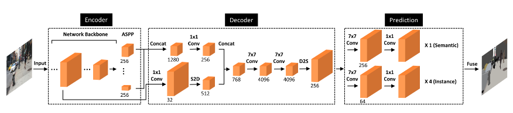

# Deeperlab
This project aims at providing a fast, modular reference implementation for semantic segmentation models using PyTorch.


## Highlights
- **Distributed Training:** **>60%** Thank you ycszen, from his struct faster than the multi-thread parallel method([nn.DataParallel](https://pytorch.org/docs/stable/nn.html#dataparallel)), we use the multi-processing parallel method.
- **Multi-GPU training and inference:** support different manners of inference.
- Provides pre-trained models and implement different semantic segmentation models.

## Prerequisites
- PyTorch 1.0
  - `pip3 install torch torchvision`
- Easydict
  - `pip3 install easydict`
- [Apex](https://nvidia.github.io/apex/index.html)
- Ninja
  - `sudo apt-get install ninja-build`
- tqdm
  - `pip3 install tqdm`  
  
## Pretrain Model  
- [xception-71](https://www.dropbox.com/s/1hplpzet9d7dv29/xception-c0a72b38.pth.tar?dl=1)(pretrain)

## Model Zoo
### Supported Model
- [deeperlab](https://arxiv.org/abs/1902.05093)(CVPR2019)    
  
### Performance and Benchmarks
SS:Single Scale MSF:Multi-scale + Flip  

### PASCAL VOC 2012(SBD and Never SBD)
because I only realize the segmentation part,I tested its results on voc

Dataset | Total | IoU>0.3 | IoU>0.5 | IoU>0.75 | Average  
:--:|:--:|:--:|:--:|:--:|:--:
 deeperlab(ours+SBD)  | R101_v1c | *train_aug*  | *val*  | 79.71 | 80.26 
 deeperlab(ours)   | R101_v1c | *train_aug*  | *val*  | 73.28 | 74.11 
### To Do
  - [ ] Detection part  
## Link
we must build the env for training 
```bash
make link
make others
```
soft link to data,pretrain,log,logger

## Training
1. create the config file of dataset:`train.txt`, `val.txt`, `test.txt`   
    file structure：(split with `tab`)
    ```txt
    path-of-the-image   path-of-the-groundtruth
    ```
2. modify the `config.py` according to your requirements
3. train a network:

### Distributed Training
We use the official `torch.distributed.launch` in order to launch multi-gpu training. This utility function from PyTorch spawns as many Python processes as the number of GPUs we want to use, and each Python process will only use a single GPU.

For each experiment, you can just run this script:
```bash
export NGPUS=8
python -m torch.distributed.launch --nproc_per_node=$NGPUS train.py
```

### Non-distributed Training
The above performance are all conducted based on the non-distributed training.
For each experiment, you can just run this script:
```bash
bash train.sh
```

In train.sh, the argument of `d` means the GPU you want to use.

## Inference
In the evaluator, we have implemented the multi-gpu inference base on the multi-process. In the inference phase, the function will spawns as many Python processes as the number of GPUs we want to use, and each Python process will handle a subset of the whole evaluation dataset on a single GPU.
1. evaluate a trained network on the validation set:
    ```bash
    bash eval.sh
    ```
2. input arguments in shell:
    ```bash
    usage: -e epoch_idx -d device_idx -c save_csv [--verbose ] 
    [--show_image] [--save_path Pred_Save_Path]
    ```

## Segmentation-torch
if you are interested my algorithm, you can see my realized segmentation tool(dfn,deeperlab,deeplabv3 plus and so on):  
- [segmentation-torch](https://github.com/lingtengqiu/segmentation-torch) 

## Be Care for
because my device is 1080, we can't use 7*7 conv in two 4096 channel due to out of memory. so if you use it. you can change it in model/deeperlab.py  

